# Engineering_4_Notebook

&nbsp;

## Table of Contents
* [Launch_Pad_1](#Launch_Pad_1)
* [Launch_Pad_2](#Launch_Pad_2)
* [Launch_Pad_3](#Launch_Pad_3)
* [Launch_Pad_4](#Launch_Pad_4)
* [Crash Avoidance 1](#Crash_Avoidance_1)
* [Crash Avoidance 2](#Crash_Avoidance_2)
* [Crash Avoidance 3](#Crash_Avoidance_3)
* [Landing Area 1](#Landing_Area_1)
* [Landing Area 2](#Landing_Area_2)
* [Morse Code 1](#Morse_Code_1)
* [Morse Code 2](#Morse_Code_2)
* [FEA Part 1](#FEA_Part_1)
* [FEA Part 2](#FEA_Part_2)
* [FEA Part 3](#FEA_Part_3)
* [Ring and Spinner](#Ring_and_Spinner)
* [Key and Prop](#Key_and_Prop)
* [Assembling the Launcher](#Assembling_the_Launcher)

&nbsp;

## Launch_Pad_1

### Description 

The goal of this assignment was to use a for loop to make a rasberry pi print a countdown from 10 and then say liftoff in its serial moniter. 

### Evidence 

### Code

[Launch Pad 1 Code](raspberry-pi/Launch_1.py )

### Reflection 

The main thing I needed help with on this assignment was how to make the for function count down instead of up. I needed to change the last value of the for function and make it -1 to count down instead of 1 to count up. (for x in range(10, 0, -1):). The 10 and 0 tell the program to start at 10 and end at 0. -1 is the integer at which it counts at. 

## Launch_Pad_2

### Description 

The goal of of this assignment was to add on to the code used in the previous assignment and make a LED flash green everytime it counted down and make another LED flash red when it got to liftoff.

### Evidence 

### Code

[Launch Pad 2 Code](raspberry-pi/Launch_2.py)

### Wiring 

### Reflection 

The one thing that I was stuck on was how to make two seperate LEDs so the green can blink seperatly from the red. You have to make a led1 and led2 to make this work.
Like this - 
led1=digitalio.DigitalInOut(board.GP13)
led2=digitalio.DigitalInOut(board.GP18)

## Launch_Pad_3

### Description

The goal of this project was to have the code do exactly what it did in launch 2 but have you control when the countdown starts with the press of a button. 

### Evidence 

### Code

[Launch Pad 3 Code](raspberry-pi/Launch_3.py )

### Wiring 

### Reflection 

If you use the 3V3 pin on your Pico you have to use button.pull = digitalio.Pull.UP rather than pulling down. This means when you press the button it will read as button value equals true so you put your liftoff code under a while true function rather than a while false function. The (if button.value == False:) function will run if its not pressed as the button value is false.

## Launch_Pad_4

### Description

The goal of this assignment was to build on Launch 3 and make a servo move 180 degrees simultaniously with the green light blinking and the moniter printing liftoff at the end of the countdown. 

### Evidence 

### Code

[Launch Pad 4 Code](raspberry-pi/Launch_4.py )

### Wiring 

### Reflection 

One key to this assignment was to set the servo to zero before your while true loop runs. This makes sure that when you run your loop and it tells the servo to move to 180 degrees it won't already be there. (servo1.angle = 0). Then after liftoff write, (servo1.angle = 180) to move it 180 degrees from its previous, set position. 

## Crash_Avoidance_1

### Description

The goal of this assignment was to print off the Y, X, and Z coordinates of an accelerometer 

### Evidence

### Code

[Crash 1 Code](raspberry-pi/Crash_1.py)

### Wiring 

### Reflection 

One thing hard with this assignment was making it read off the right coordinates for each axis. For instance, having it read off the x coordinates when it moves in the x direction. You have to use {mpu.gyro[0]} for the x axis, {mpu.gyro[1]} for Y, and {mpu.gyro[2]} for Z.

## Crash_Avoidance_2

### Description

The goal of this assignment was to build on crash 1 and make it so a red led turned on everytime the accelerometer moved past a 90 degree angle in either of the 4 directions. 

### Evidence

### Code

[Crash 2 Code](raspberry-pi/Crash_2.py)

### Wiring 

### Reflection 

The main thing I needed to figure out to make this code work was where to put the if else functions. You need to have the while true function then inside of it have the code to print the values and then after that chunck have the if else function. You also need to make sure to have it not just when it reads over 9 but also if it reads less that -9 - if mpu.acceleration[0]>9 or mpu.acceleration[1]>9 or mpu.acceleration[0]<-9 or mpu.acceleration[1]<-9:.

## Crash_Avoidance_3

### Description

The goal of this assignment was to make a OLED screen read the X,Y, and Z coordinates of a onboard accelerometer. A Red LED will also turn off if the accelerometer breaks 90 degrees in any direction. 

### Evidence

### Code

[Crash 3 Code](raspberry-pi/Crash_3.py)

### Wiring 

### Reflection 

One thing that was challenging in this assignment was learning how to make a splash function run over and over again and not just text on top of eachother. Have ( splash = displayio.Group()) before the code to print on the OLED screen in your while True: loop. I also had trouble rounding the coordinates. Just use round(variable,ndigits). For example -  list = (f"X : {round(mpu.acceleration[0],3)} rad/s") 

## Landing_Area_1

### Description

The goal for this assignment was to make a function that asked for the coordinates of a triangle then would find and print the area of said triangle.

### Evidence

### Code 

[Landing 1 Code](raspberry-pi/Landing_1.py)

### Reflection

One thing I learned during this assignment was the float function. The float function converts characters into actual numbers the program can use. For example, after asking for the user to input what the value for x1 is use the float function -  x1 = float(x1) - to make it into a number the computer can use.  

## Landing_Area_2

### Description

The goal for this assignment was to build on the last and make it print everything on a OLED screen including a graph of the triangle. 

### Evidence

### Wiring

### Code 

[Landing 2 Code](raspberry-pi/Landing_2.py)

### Reflection

One thing I learned about during this assignment was the int function. In the context of this assignment this function takes a number and makes its a coordinate that can be printed on a OLED screen. One thing we did was add or subract to the int to make it print where we wanted on the OLED screen. For example, you had to add 64 to all x values and make the int negative and add 32 to all y values - int(xcoor1) + 64, -int(ycoor1) + 32.

## Morse_Code_1

### Description

The goal of this assignment was to convert text into morse code. The program would ask for a input then spit it out in morse code adding spaces between letters and slashes between words.

### Evidence 

### Code 

[Morse Code 1 Code](raspberry-pi/Morse_1.py)

### Reflection

One thing I struggled with was string concatenation. I couldn't figure out how to add the previous word to the new word on the same line. What You have to do is create a variable thats whatever you printed last plus whats now being input. umym = umym + MORSE_CODE[letter] + " " then print(umym). 

## Morse_Code_2

### Description 

The goal of this assignment was to build on the last and make the led blink accordingly to the morse code.

### Evidence

### Code

[Morse Code 2 Code](raspberry-pi/Morse_2.py)

### Reflection 

The key to this assignment was to use the "for character in umym:" loop. This goes through each character in a string and depending on the character it acts out different loops. You then have to add the new character to the previous line using (umym = umym + MORSE_CODE[letter] + " ")  

## FEA_Part_1

### Assignment Description

The goal of this assignment was to create a beam that would hold the maximum amount of weight, 180mm from the attachment block. 

### Part Link

[Beam](https://cvilleschools.onshape.com/documents/1c372a26d05ac860d61f4583/w/8a4ee036685a2dabb1b46d17/e/294ad1c84cae18d2c06b544d?renderMode=0&uiState=6363fc9f9f09cf7adfb8821b)

### Part Image

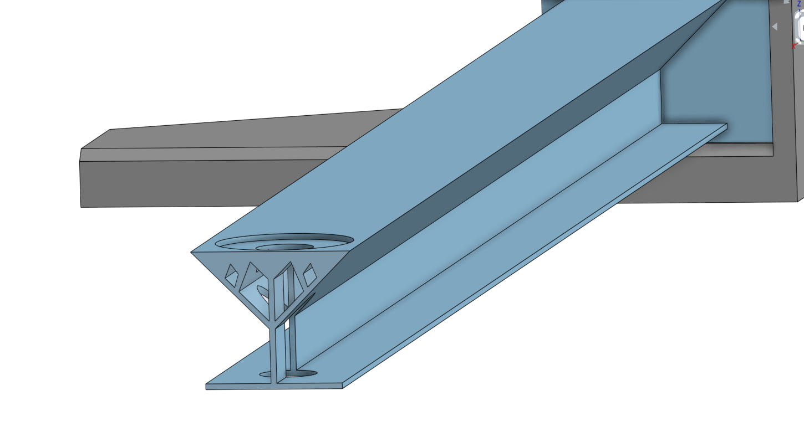

### Reflection

Maintaining the correct weight was one of the biggest challenges throughout this entire assignment. One tool that was very helpful for me was chamfer. The assignment required the beam and attachment block piece to be under 13 grams so extruding holes in the beam and then chamfering the edges was a great way to lower the weight. 

## FEA_Part_2

### Assignment Description

In this assignment we used SimScale to simulate weight on our beam. This would show the points of stress and displacement that would act on our beam. This allows us to build on our design and improve it. 

### Part Link

[Beam](https://cvilleschools.onshape.com/documents/1c372a26d05ac860d61f4583/w/8a4ee036685a2dabb1b46d17/e/294ad1c84cae18d2c06b544d?renderMode=0&uiState=636bfb308e26641b9e70d8a3)

### Part Image

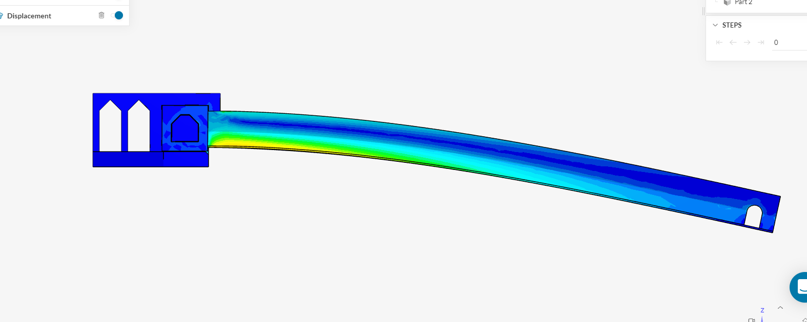

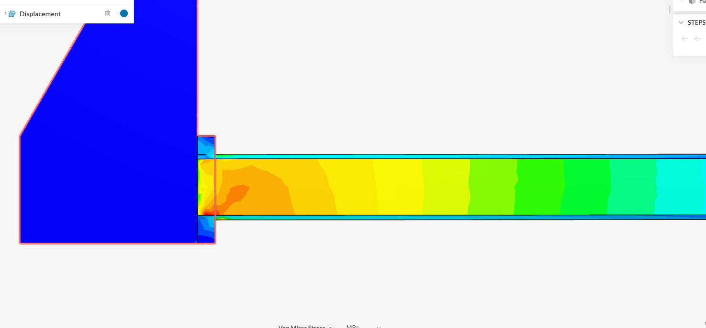

### Reflection

One point of improvement in our design is the bottom beam. It is very slim at an area with a lot of stress so I will need to thicken this section and then shave off of parts of the beam with less stress to maintian the weight limit. A lot of this assignnment is figuring out where to take material and where to give material in order to make the strongest possible beam.

## FEA_Part_3

### Assignment Description

The goal of this assingment was to use the SimScale simulation to improve your beam. 

### Part Link

[Beam](https://cvilleschools.onshape.com/documents/1c372a26d05ac860d61f4583/w/8a4ee036685a2dabb1b46d17/e/294ad1c84cae18d2c06b544d?renderMode=0&uiState=636bfb308e26641b9e70d8a3)

### Part Image

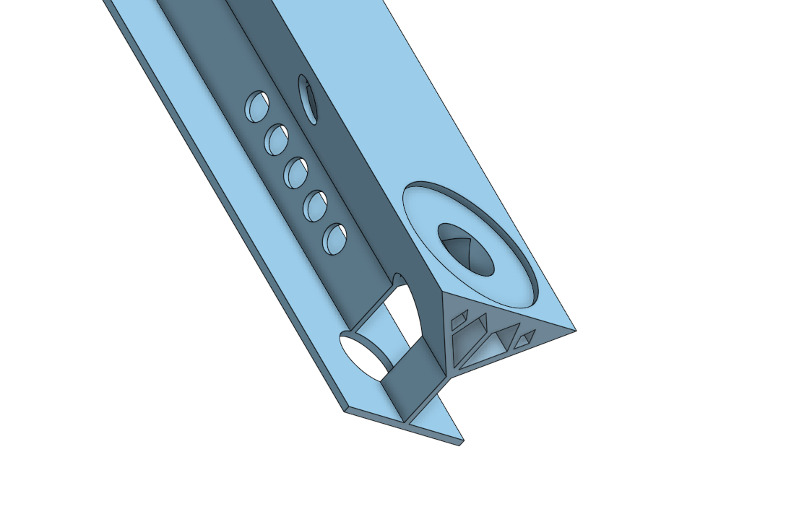

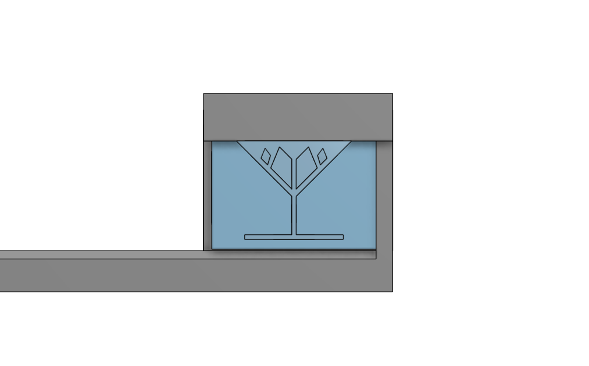

### Reflection

I made the height of the beam shorter and thickened the bottom beam to increase strength and stability. The test showed that it was not enough as the bottom beam waved then shattered showing it was not flexibkle enough. In future designs I would reinforce the bottom beam even more and take mass away from more stable parts. 

## Ring_and_Spinner

### Assignment Description 

The overall goal of this assignment was to create, with a partner, a launcher that would launch a toy copter into the air. For this sub-assignment the goal was to create the "ring" used to hold the mechanism while my partner designed the "spinner". For the spinner the bottom half has teeth that will mesh with the key, in order to spin the prop. The prop rests on the top of the spinner, and lifts off of the helix cutouts. 

### Part Link 

[Copter Link](https://cvilleschools.onshape.com/documents/43e843f3a86e98c3fce92915/w/eab5d53bfa6cce676db7f375/e/05c08d906845c401d1b5f3c3?renderMode=0&uiState=6373daec3687493cd86c6233)

### Part Image

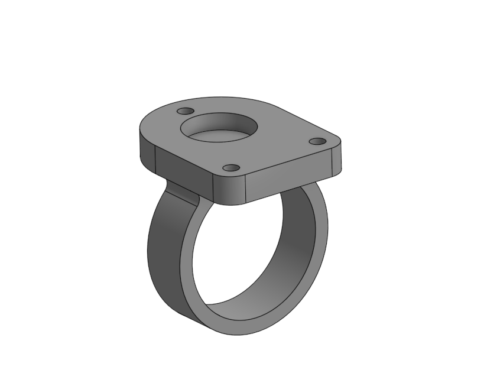

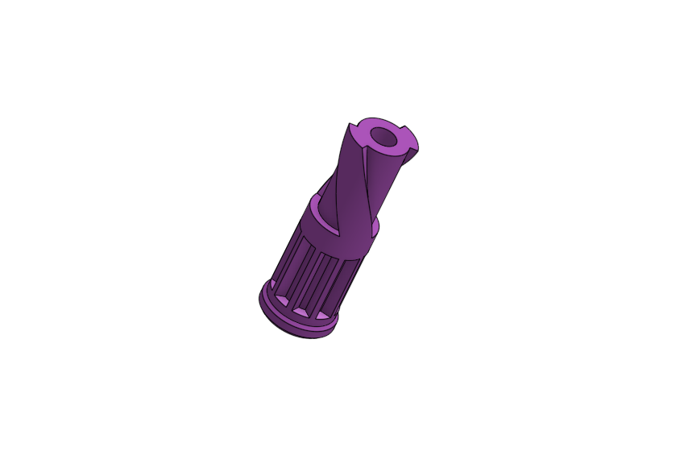

### Reflection

#### Ring - 

This assignment was fairly easy if you follow the directions. One thing that saved time was using the Use function to create the holes that the screws went through as opposed to guessing the distances. In the future I will definently make use of the Use function for most CAD projects because it allows you to make exact measurements and fits rather then measuring everything out separetly and hoping you got the distances right. 

#### Spinner - 

This part was  fairly difficult at first. I had trouble with removing some of the extruded cuts, but it wasn't too complicated. Overall, not an especially challenging process.

## Key_and_Prop

### Assignment Description 

The goal of this assignment was to create the key for the laucher. It is a key-like mechanisem with triangles cutout using a linear pattern to created the ridges used to spin/launch the prop. My partner designed the prop which is a circular disk that spins off of the top of the spinner when winded up by the key.

### Part Link

[Copter Link](https://cvilleschools.onshape.com/documents/43e843f3a86e98c3fce92915/w/eab5d53bfa6cce676db7f375/e/05c08d906845c401d1b5f3c3?renderMode=0&uiState=6373daec3687493cd86c6233)

### Part Image 

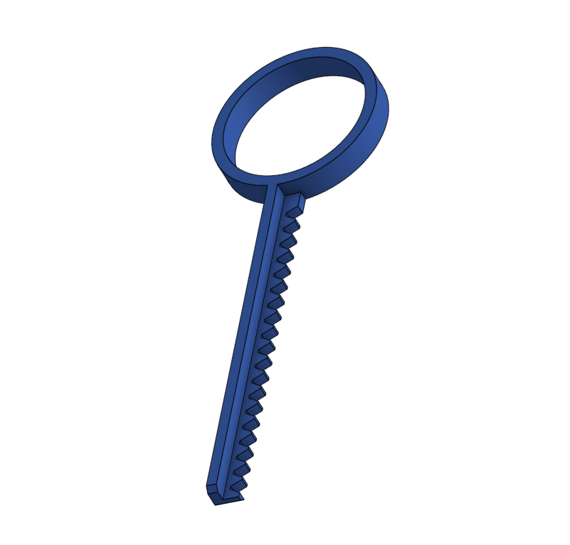

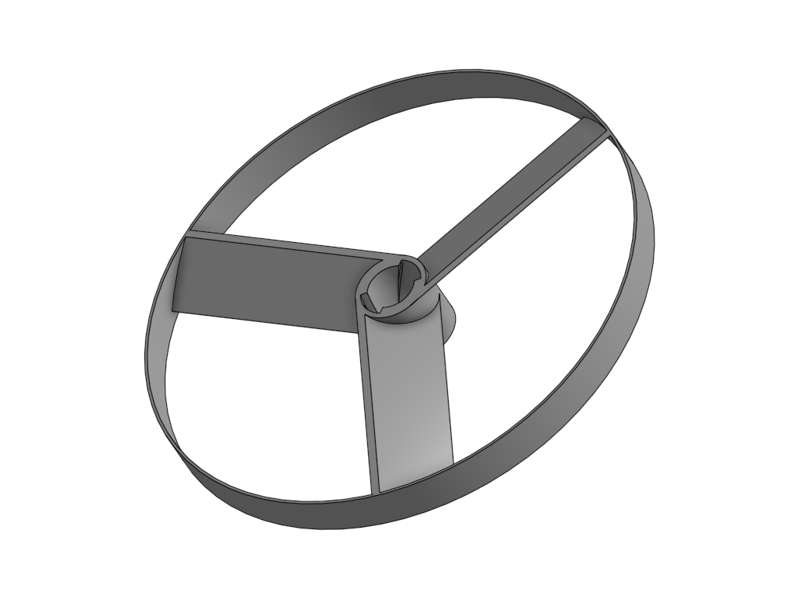

### Reflection 

#### Key - 

One thing that helped me with this assignment was using a linear pattern to create the grooves in the key. After setting the instances and distance between it was important to do a feature pattern rather than a part pattern. It was also important to have the edge of the key be the direction so it knew where to execute the function. 

#### Prop - 

This assembly included some tricky merging and extrusions/sweeps. The helix design proved difficult to work around, and I ended up having to redo it a couple times. The helix is fairly simple, however, when you get the hang of it. Just make sure to set your helix on "Height and turns".

## Assembling_the_Launcher 

### Assignment Description 

The goal of this assignment was to assemble all the parts into a working launcher. The assembly uses a rack and pinion mate to make the prop spin as the key is pulled out and inserted.

### Part Link

[Copter Link](https://cvilleschools.onshape.com/documents/43e843f3a86e98c3fce92915/w/eab5d53bfa6cce676db7f375/e/05c08d906845c401d1b5f3c3?renderMode=0&uiState=6373daec3687493cd86c6233)

### Part Image

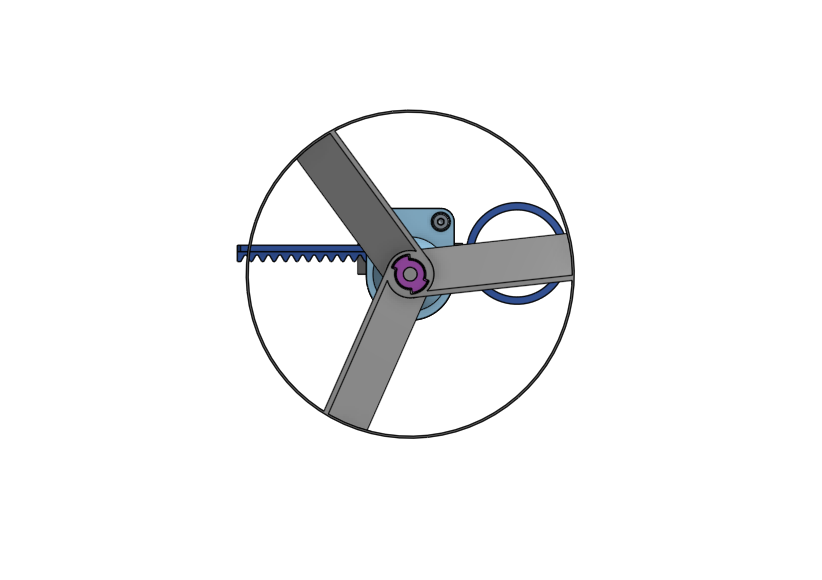

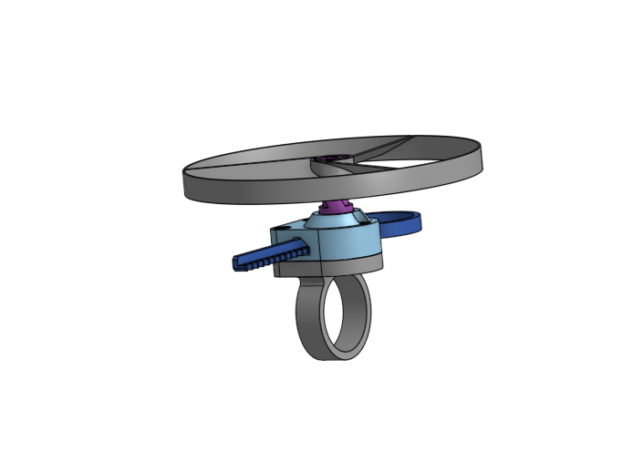

### Reflection

This was the easiest step. We worked together on the assembly, alternating each step, and then animated the motion of the rack and pinion. It was important to put on offset on the rotating mate, in order to line up the key with the spinner.

