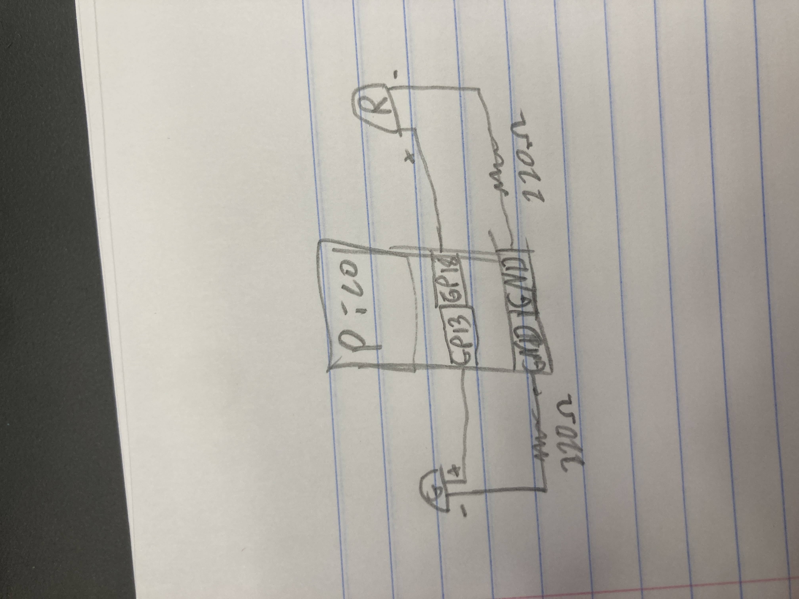
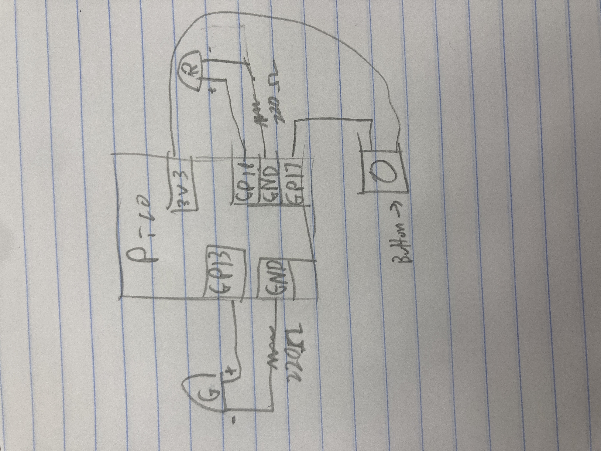
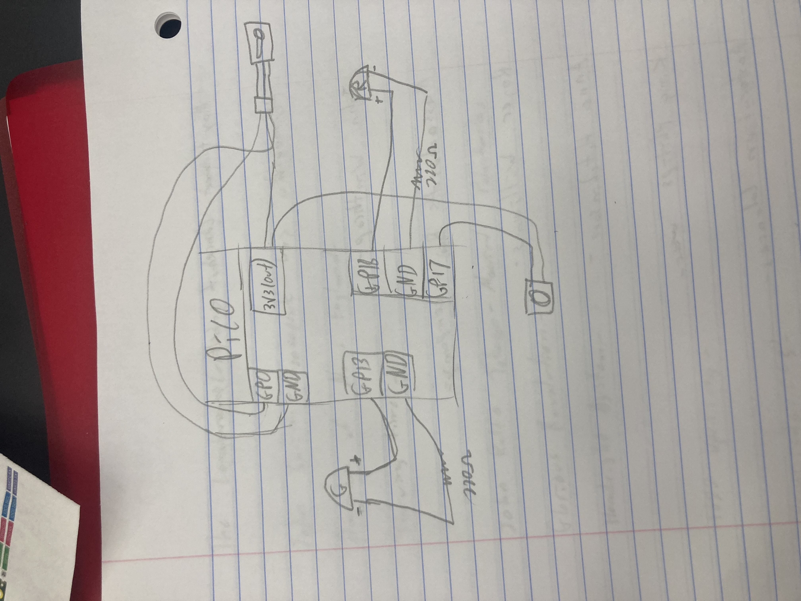
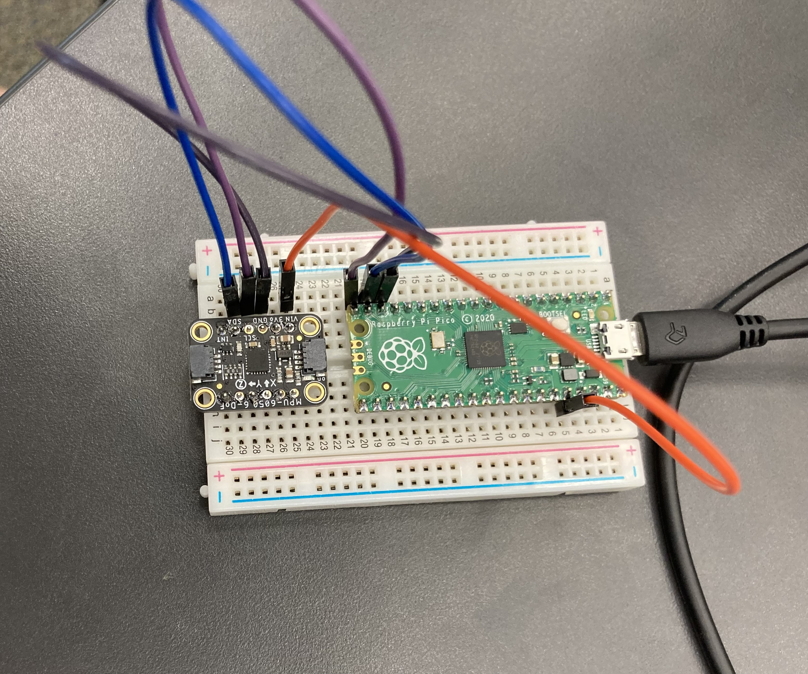
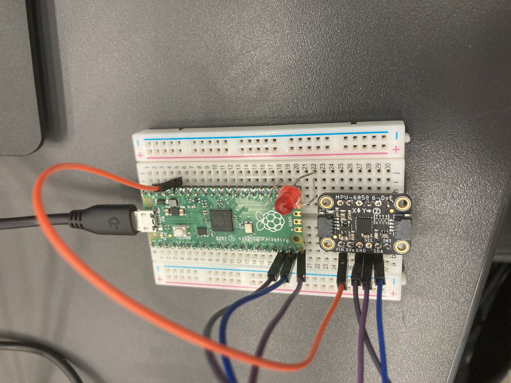
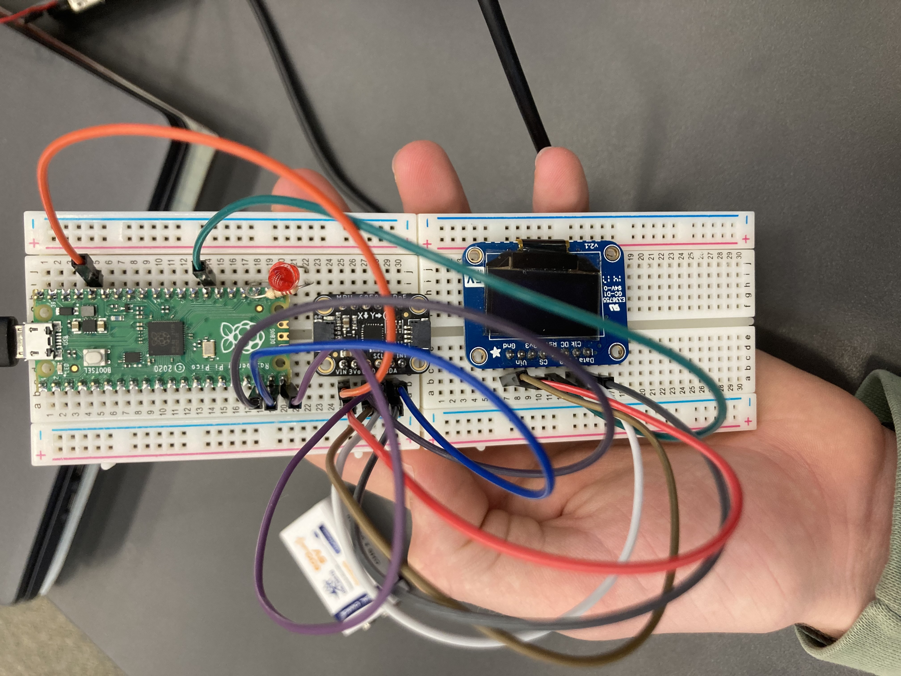
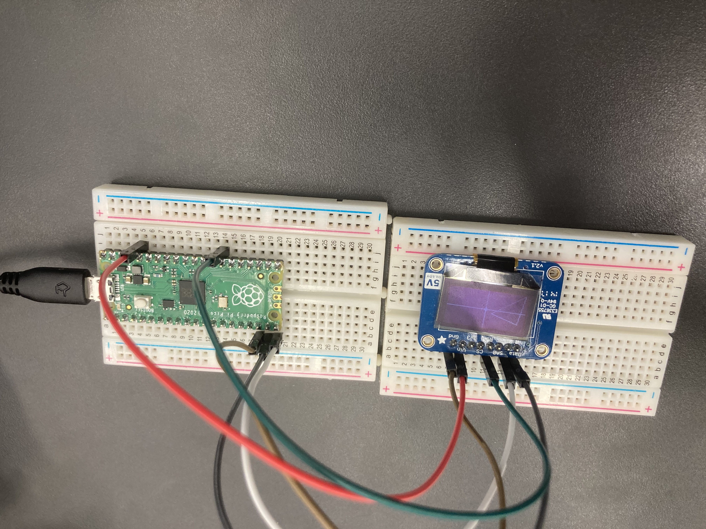
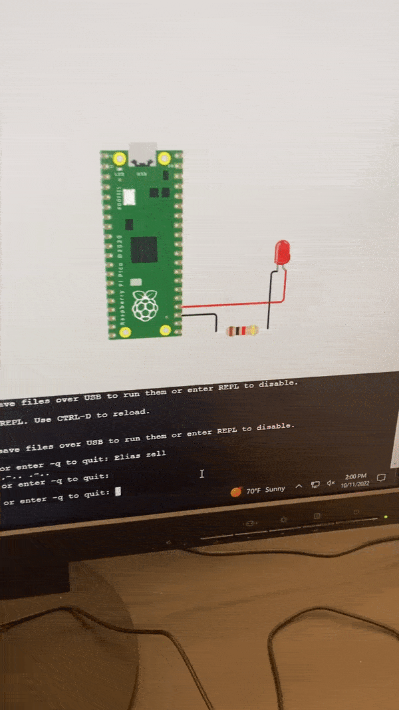

# Engineering_4_Notebook

&nbsp;

## Table of Contents
* [Launch_Pad_1](#Launch_Pad_1)
* [Launch_Pad_2](#Launch_Pad_2)
* [Launch_Pad_3](#Launch_Pad_3)
* [Launch_Pad_4](#Launch_Pad_4)
* [Crash Avoidance 1](#Crash_Avoidance_1)
* [Crash Avoidance 2](#Crash_Avoidance_2)
* [Crash Avoidance 3](#Crash_Avoidance_3)
* [Landing Area 1](#Landing_Area_1)
* [Landing Area 2](#Landing_Area_2)
* [Morse Code 1](#Morse_Code_1)
* [Morse Code 2](#Morse_Code_2)
* [Onshape_Assignment_Template](#onshape_assignment_template)

&nbsp;

## Launch_Pad_1

### Description 

The goal of this assignment was to use a for loop to make a rasberry pie serial moniter countdown from 10 and then say liftoff. 

### Evidence 

### Code

[Launch Pad 1 Code](raspberry-pi/Launch_1.py )

### Reflection 

The main thing I needed help on for this assignment was how to make the for function count down instead of up. I needed to change the last value of the for function and make it -1 to count down instead of 1 to count up.(for x in range(10, 0, -1):)

## Launch_Pad_2

### Description 

The goal of of this assignment was to add on to the code used in the previous assignment and make a LED flash green everytime it counted down and make another LED flash red when it got to liftoff.

### Evidence 

### Code

[Launch Pad 2 Code](raspberry-pi/Launch_2.py )

### Wiring 

### Reflection 

The one thing that I was stuck on was how to make two seperate LEDs so the green can blink seperatly from the red. You have to make a led1 and led2 to make this work.
Like this - 
led1=digitalio.DigitalInOut(board.GP13)
led2=digitalio.DigitalInOut(board.GP18)

## Launch_Pad_3

### Description

The goal of this project was to have the code do exactly what it did in launch 2 but have you control when the countdown starts with the press of a button. 

### Evidence 

### Code

[Launch Pad 3 Code](raspberry-pi/Launch_3.py )

### Wiring 

### Reflection 

If you use the 3V3 pin on your Pico you have to use button.pull = digitalio.Pull.UP rather than pulling down. This means when you press the button it will read as button value equals true so you put your liftoff code under a while true function rather than a while false function. 

## Launch_Pad_4

### Description

The goal of this assignment was to build on Launch 3 and make a servo move 180 degrees simultaniously with the green light blinking and the moniter printing liftoff at the end of the countdown. 

### Evidence 

### Code

[Launch Pad 4 Code](raspberry-pi/Launch_4.py )

### Wiring 

### Reflection 

One key to this assignment was to set the servo to zero before your while true loop runs so when you run your loop and it tells the servo to move to 180 degrees it won't already be there.(servo1.angle = 0) 

## Crash_Avoidance_1

### Description

The goal of this assignment was to print off the Y, X, and Z coordinates of an accelerometer 

### Evidence

### Code

[Crash 1 Code](raspberry-pi/Crash_1.py)

### Wiring 

### Reflection 

One thing hard with this assignment was making it read off the right coordinates for each axis. For instance, having it read off the x coordinates when it moves in the x direction. You have to use {mpu.gyro[0]} for the x axis, {mpu.gyro[1]} for Y, and {mpu.gyro[2]} for Z.

## Crash_Avoidance_2

### Description

The goal of this assignment was to build on crash 1 and make it so a red led turned on everytime the accelerometer moved past a 90 degree angle in either of the 4 directions. 

### Evidence

### Code

[Crash 2 Code](raspberry-pi/Crash_2.py)

### Wiring 

### Reflection 

The main thing I needed to figure out to make this code work was where to put the if else functions. You need to have the while true function then inside of it have the code to print the values and then after that chunck have the if else function. You also need to make sure to have it not just when it reads over 9 but also if it reads less that -9 - if mpu.acceleration[0]>9 or mpu.acceleration[1]>9 or mpu.acceleration[0]<-9 or mpu.acceleration[1]<-9:.

## Crash_Avoidance_3

### Description

The goal of this assignment was to make a OLED screen read the X,Y, and Z coordinates of a onboard accelerometer. A Red LED will also turn off if the accelerometer breaks 90 degrees in any direction. 

### Evidence

### Code

[Crash 3 Code](raspberry-pi/Crash_3.py)

### Wiring 

### Reflection 

One thing that was challenging in this assignment was learning how to make a splash function run over and over again and not just text on top of eachother. I also had trouble rounding the coordinates. Just use round(variable,ndigits). For example -  list = (f"X : {round(mpu.acceleration[0],3)} rad/s") 

### Landing_Area_1

### Description

The goal for this assignment was to make a function that asked for the coordinates of a triangle then would find and print the area of said triangle.

### Evidence

### Code 

[Landing 1 Code](raspberry-pi/Landing_1.py)

### Reflection

One thing I learned during this assignment was the float function. The float function converts characters into actual numbers the program can use. For example, after asking for the user to input what the value for x1 is use the float function -  x1 = float(x1) - to make it into a number the computer can use.  

### Landing_Area_2

### Description

The goal for this assignment was to build on the last and make it print everything on a OLED screen including a graph of the triangle. 

### Evidence

### Wiring

### Code 

[Landing 2 Code](raspberry-pi/Landing_2.py)

### Reflection

One thing I learned about during this assignment was the int function. In the context of this assignment this function takes a number and makes its a coordinate that can be printed on a OLED screen. One thing we did was add or subract to the int to make it print where we wanted on the OLED screen. For example, you had to add 64 to all x values and make the int negative and add 32 to all y values - int(xcoor1) + 64, -int(ycoor1) + 32.

### Morse_Code_1

### Description

The goal of this assignment was to convert text into morse code. The program would ask for a input then spit it out in morse code adding spaces between letters and slashes between words.

### Evidence 

### Code 

[Morse Code 1 Code](raspberry-pi/Morse_1.py)

### Reflection

One thing I struggled with was string concatenation. I couldn't figure out how to add the previous word to the new word on the same line. What You have to do is create a variable thats whatever you printed last plus whats now being input. umym = umym + MORSE_CODE[letter] + " " then print(umym). 

### Morse_Code_2

### Description 

The goal of this assignment was to build on the last and make the led blink accordingly to the morse code.

### Evidence

### Code

[Morse Code 2 Code](raspberry-pi/Morse_2.py)

### Reflection 

The key to this assignment was to use the "for character in umym:" loop. This goes through each character in a string and depending on the character it acts out different loops. You then have to add the new character to the previous line using (umym = umym + MORSE_CODE[letter] + " ")  

## Onshape_Assignment_Template

### Assignment Description

Write your assignment description here. What is the purpose of this assignment? It should be at least a few sentences.

### Part Link 

[Create a link to your Onshape document](https://cvilleschools.onshape.com/documents/003e413cee57f7ccccaa15c2/w/ea71050bb283bf3bf088c96c/e/c85ae532263d3b551e1795d0?renderMode=0&uiState=62d9b9d7883c4f335ec42021). Don't forget to turn on link sharing in your Onshape document so that others can see it. 

### Part Image

Take a nice screenshot of your Onshape document. 

### Reflection

What went wrong / was challenging, how'd you figure it out, and what did you learn from that experience? Your goal for the reflection is to pass on knowledge that will make this assignment better or easier for the next person. Think about your audience for this one, which may be "future you" (when you realize you need some of this code in three months), me, or your college admission committee!

&nbsp;

## Media Test

Your readme will have various images and gifs on it. Upload a test image and test gif to make sure you've got the process figured out. Pick whatever image and gif you want!

### Test Link

[Google](http://www.google.com)

### Test Github

[Code](raspberry-pi)

### Test Image

  

### Test GIF

